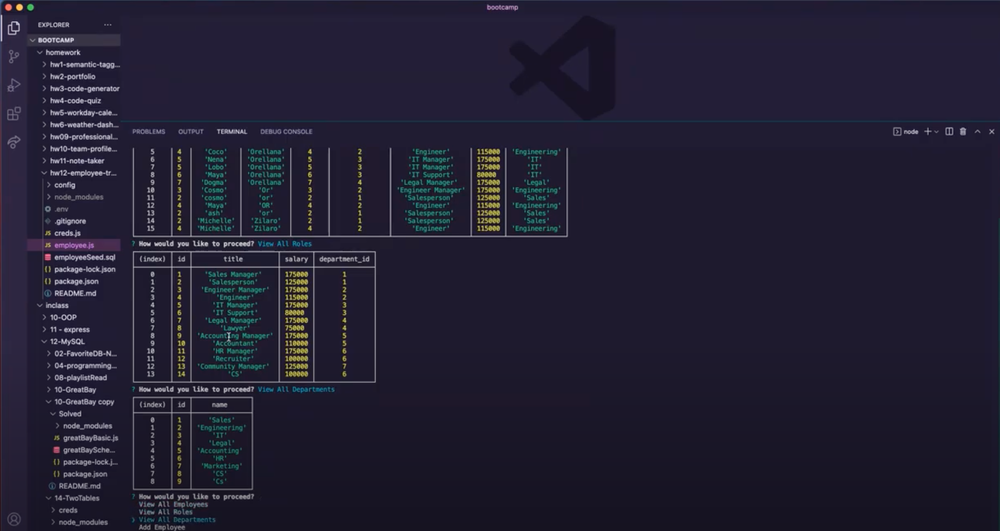

# hw12-employee-tracker


## Screenshot of Employee Tracker



---
## Demo of the app

To run the app you will need to add the following command to the terminal

```
node server.js
```
(Click on the image below to be redirected to the Youtube demo video)

[]()

---
## My task

My task for this homework was to create an Employee Tracker to manage a company's employees using node, inquirer, and MySQL.

We have three different tables one for department, one for role and one for employee information. 

The department table has an id and the name of the department.

The role table has and id, title of the employee (role), salary and the department id.

The employee table has the first and last names of the employee, role id and the manager id. 


---
## Criteria

```
Build a command-line application that at a minimum allows the user to:

  * Add departments, roles, employees

  * View departments, roles, employees

  * Update employee roles

```